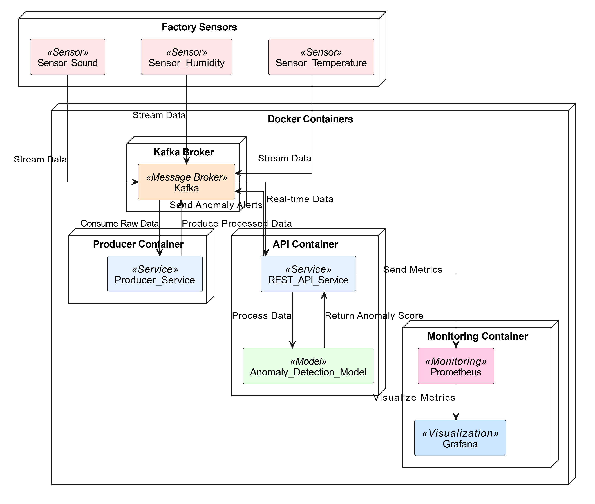

### Anomaly Detection in IoT Setting

---

#### Project Overview
This project focuses on building an **anomaly detection system** for a modern factory producing machine components for wind turbines. The system uses sensor data (temperature, humidity, and sound) to detect anomalies in the production cycle. The system is designed to process continuous data streams, predict anomalies using a machine learning model, and expose predictions via a RESTful API.

---

### Project Structure
The project is organized as follows:

```
Anomaly_Detection/
├── .venv/                          # Virtual environment (optional)
├── conceptual_architecture/        # Conceptual architecture diagram
│   └── architecture.pmg            # Visual overview of the system
├── producer/                       # Kafka producer for simulating sensor data
│   ├── producer.py                 # Script to generate and send sensor data to Kafka
│   ├── Dockerfile                  # Dockerfile for the producer
│   └── requirements.txt            # Python dependencies for the producer
├── model_training/                 # Model training and dataset generation
│   ├── generate_dataset.py         # Script to collect sensor data from Kafka
│   ├── train_model.py              # Script to train the anomaly detection model
│   └── sensor_data.json            # Sample dataset (generated by generate_dataset.py)
├── api/                            # RESTful API for anomaly detection
│   ├── app.py                      # Flask app to serve predictions
│   ├── anomaly_model.joblib        # Trained anomaly detection model
│   ├── scaler.joblib               # StandardScaler for preprocessing
│   ├── Dockerfile                  # Dockerfile for the API
│   └── requirements.txt            # Python dependencies for the API
├── prometheus.yml                  # Prometheus configuration file
├── docker-compose.yml              # Docker Compose for the full system
├── docker-compose.local.yml        # Docker Compose for local Kafka setup
├── requirements.txt                # Global Python dependencies
└── README.md                       # This file
```
---

### Visual Overview of the System


---

### Key Features
1. **Data Ingestion**: Simulated sensor data is generated and sent to a Kafka topic.
2. **Anomaly Detection**: A simple Isolation Forest model is trained to detect anomalies in the sensor data.
3. **RESTful API**: The trained model is exposed via a Flask API to provide real-time anomaly predictions.
4. **Monitoring**: Prometheus and Grafana are used for monitoring the system.
5. **Scalability**: The system is containerized using Docker and can be scaled using Docker Compose.

---

### Prerequisites
1. **Python 3.8+**
2. **Docker** and **Docker Compose**
3. **Kafka** (included in Docker Compose)
4. **Prometheus** and **Grafana** (optional, for monitoring)

---

### Installation Instructions

#### 1. Install Docker and Docker Compose
- **Docker**: Follow the official installation guide for your operating system:
  - [Install Docker on Windows](https://docs.docker.com/desktop/install/windows-install/)
  - [Install Docker on macOS](https://docs.docker.com/desktop/install/mac-install/)
  - [Install Docker on Linux](https://docs.docker.com/engine/install/)
- **Docker Compose**: Docker Compose is included with Docker Desktop for Windows and macOS. For Linux, follow the [official installation guide](https://docs.docker.com/compose/install/).

#### 2. Clone the Repository
```bash
git clone https://github.com/CRMawande/anomaly_detection.git
cd Anomaly_Detection
```

#### 3. Set Up the Environment
- Create a virtual environment (optional):
  ```bash
  python -m venv .venv
  source .venv/bin/activate  # On Windows: .venv\Scripts\activate
  ```
- Install dependencies:
  ```bash
  pip install -r requirements.txt
  ```

#### 4. Build and Start Containers
Build and start the containers using Docker Compose:
```bash
docker-compose up --build
```

#### 5. View Logs
To view logs for specific services, use:
```bash
docker-compose logs <service_name>
```
For example:
```bash
docker-compose logs api
docker-compose logs producer
```

---

### Notes on Data Generation
The dataset `sensor_data.json` in the `model_training` folder was generated using the following steps:
1. Start Kafka and Zookeeper using the provided Docker Compose file:
   ```bash
   docker-compose -f docker-compose.local.yml up -d
   ```
2. Modify `producer/producer.py` to change `kafka:9092` to `localhost:9092`.
3. Run the Kafka producer to simulate sensor data:
   ```bash
   python producer/producer.py
   ```
4. Collect sensor data for training:
   ```bash
   python model_training/generate_dataset.py
   ```
This process is only necessary if you want to generate fresh data. The provided `sensor_data.json` can be used directly for training.

---

### Monitoring
- **Prometheus**: Access at `http://localhost:9090`
- **Grafana**: Access at `http://localhost:3000` (default credentials: admin/admin)

---

### Future Improvements
1. Implement cloud deployment (e.g., AWS, GCP, Azure).
2. Add more sophisticated anomaly detection models.
3. Improve monitoring and alerting mechanisms.

---

### Reproducibility
To reproduce the project:
1. Clone the repository.
2. Follow the setup instructions.
3. Access the code and documentation in the repository.

---

### License
This project is licensed under the MIT License [LICENSE](LICENSE).

---

### Contact
For questions or feedback, please contact:
- **Charmaine**
- **Email**: charmaine.mawande@iu-study.org
 
---


